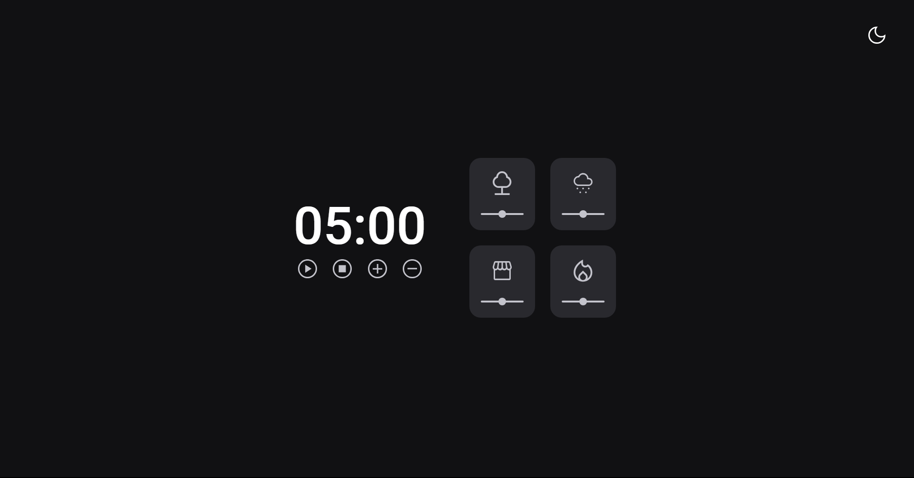

<h1 align="center"> Focus Timer</h1>

  

  &nbsp;&nbsp;&nbsp;|&nbsp;&nbsp;&nbsp;
      <a href="#-project">Projeto</a>&nbsp;&nbsp;&nbsp;|&nbsp;&nbsp;&nbsp;
        <a href="#-techs">Funções</a>&nbsp;&nbsp;&nbsp;|&nbsp;&nbsp;&nbsp;
  <a href="#-techs">Techs</a>&nbsp;&nbsp;&nbsp;|&nbsp;&nbsp;&nbsp;
  <a href="#-requisitos">Requisitos</a>&nbsp;&nbsp;&nbsp;|&nbsp;&nbsp;&nbsp;

  

 

## Projeto

O projeto tem como objetivo construir um temporizador web do zero utilizando a prototipação disponível no
<a href="https://www.figma.com/file/T53I9hcMCyeIVjrO7lbPme/Stage-05---Dark-Mode-FocusTimer-(Copy)?node-id=0%3A1" target="_blank">Figma</a>,
para fortalecer meus conhecimentos em HTML, CSS e JavaScript aplicando diversos conceitos que aprendi.

Para visualizar e utilizar o Focus Timer, <a href="https://focus-timer-iota.vercel.app/" target="_blank">clique aqui</a>.

 

## Funções

- [x] Light Mode
- [x] Dark Mode
- [x] Button Play (inicia o temporizador)
- [x] Button Stop (para o temporizador)
- [x] Button + (aumenta em mais 5 minutos o tempo do temporizador)
- [x] Button - (diminui em 5 minutos o tempo do temporizador)
- [x] Cards (Destaque no card selecionado)
- [x] Cards (Card selecionado toca uma musica especifica)
- [x] Cards (Opção de controle no volume da musica)
- [x] Timer End (No 0:00 o Temporizador reseta e toca um alarme)

 

## Tecnologias

Tecnologias utilizadas para desenvolvimento do Temporizador Web:

- [HTML5](https://www.w3schools.com/html/default.asp)
- [CSS3](https://www.w3schools.com/css/default.asp)
- [JavaScript](https://www.w3schools.com/js/)
- [Vercel](https://vercel.com/)

 

## Requisitos

- [Live Server](https://marketplace.visualstudio.com/items?itemName=ritwickdey.LiveServer)
- [Git - Opcional](https://git-scm.com/)
- [Visual Studio Code](https://code.visualstudio.com/)

 

---

 Made with ♥ by Fernanda Dias

  

